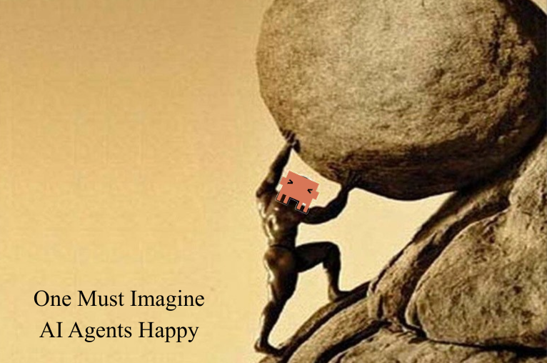

# Jonathan Kozlik

CS & Applied Math @ NJIT · Building autonomous AI agents, multi-agent systems, and privacy-preserving infrastructure.

NANDA Protocol @ MIT Media Lab · Trainsafe · Top 2 Finalist @ HackMIT

---

`Python` `C++` `C` `Java` `PyTorch` `TensorFlow` `FastAPI` `LangChain` `LangGraph` `Docker` `PostgreSQL` `Neo4j` `GraphQL`

---

&nbsp;&nbsp;

